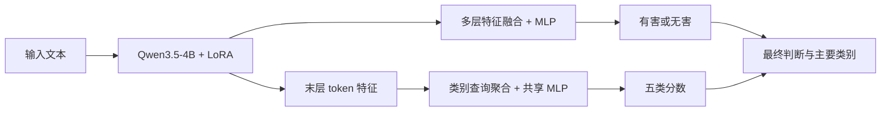

# hanguard

**面向大语言模型应用的中文输入安全分类器。**

hanguard 对输入文本进行有害／无害判断，并为有害文本识别一个主要风险类别。它基于 Qwen3.5-4B，结合 LoRA、多层特征融合与类别查询聚合，提供命令行推理、批量处理和 HTTP 接口，可用于应用输入审核与安全分类研究。

[快速开始](#快速开始) · [使用方式](#使用方式) · [模型方法](#模型方法) · [数据集](#数据集) · [实验结果](#实验结果) · [训练与评估](#训练与评估)

## 功能

- **有害识别与风险分类**：输出有害判断、主要类别及对应概率，支持五类风险标签。
- **共享模型计算**：两个分类头共用一次骨干前向计算，直接从文本特征产生预测。
- **多种接入方式**：支持单条文本、交互式输入、批量文件和常驻 HTTP 服务。
- **完整文本处理**：支持最多 4,096 token 的输入；超长文本明确报错，不自动截断。

## 快速开始

### 安装

运行环境为 Python 3.10、支持 BF16 的 CUDA GPU。依赖包括 PyTorch 2.6.0 和 Transformers 5.3.0，完整版本见 [requirements.txt](requirements.txt)。

```bash
git clone https://github.com/HDURAIN/HanGuard.git
cd HanGuard
python3.10 -m venv .venv-hanguard
source .venv-hanguard/bin/activate
python -m pip install -r requirements.txt
```

### 准备模型

推理需要 [Qwen3.5-4B 基座](https://huggingface.co/Qwen/Qwen3.5-4B)和 hanguard 推理包，按以下结构放置：

```text
models/
├── Qwen3.5-4B/          # 完整基座权重、配置和 tokenizer
└── hanguard/
    ├── model.json      # 模型配置、分类阈值与文件校验信息
    ├── binary_adapter.pt
    ├── binary_head.pt
    └── category_head.pt
```

Git 仓库包含代码、数据元信息和文档，未提供 hanguard 推理包与正式语料的下载入口。运行前需另行取得模型文件，或在备齐数据后通过[训练与导出流程](#训练与评估)生成推理包。加载器读取本地文件，并校验模型配置与权重是否匹配。

### 运行

```bash
python infer.py --text '请介绍如何识别网络诈骗，并保护自己的个人信息。'
```

输出示例：

```text
无害
安全
```

运行内置演示：

```bash
python demo_infer.py
```

## 使用方式

### 命令行与批量推理

```bash
# 输出 JSON，包含标签和概率
python infer.py --text '请根据公司公开年报，总结它的主要业务。' --json

# 交互式输入，输入 /quit 退出
python infer.py --interactive

# 批量文件，每条记录包含 prompt 字段
python infer.py --input examples/prompts.jsonl \
  --output outputs/predictions.jsonl --batch-size 8
```

批量输入和输出支持 CSV、Parquet、JSON、JSONL。使用 `--model /path/to/model.json` 指定推理包，使用 `--device cuda:0` 指定设备。更多输入示例见 [examples](examples/README.md)。

### HTTP 服务

```bash
python server.py --host 127.0.0.1 --port 8000
```

发送请求：

```bash
curl -s http://127.0.0.1:8000/classify \
  -H 'Content-Type: application/json' \
  -d '{"prompt":"请介绍个人信息保护的基本原则。"}'
```

| 接口 | 用途 |
|---|---|
| `POST /classify` | 单条分类，请求体为 `{"prompt":"文本"}` |
| `POST /classify/batch` | 批量分类，请求体为 `{"prompts":["文本一","文本二"]}` |
| `GET /health` | 服务存活检查 |
| `GET /ready` | 模型就绪检查 |

单条 JSON 结果包含 `safety_label`、`category_id`、`category_label`、`harmful_probability` 和 `category_probabilities` 等字段。五类概率表示类型头的预测分布；最终是否有害由二分类概率与阈值决定。

### 风险类别

| ID | 类别 |
|---|---|
| 0 | 安全 |
| 1 | 违反社会主义核心价值观的内容 |
| 2 | 歧视性内容 |
| 3 | 商业违法违规 |
| 4 | 侵犯他人合法权益 |
| 5 | 无法满足特定服务类型的安全需求 |

类型头预测 1–5 中的一个主要类别；当二分类判为无害时，最终类别为 0。类别定义沿用数据来源标签，标准框架及边界说明见[类别标准](docs/primary_category_standard_review.md)。

## 模型方法

hanguard 采用共享骨干、两个分类头的结构：



**有害识别**提取第 8、16、24、32 层末 token 的特征，通过可学习权重融合，并与末层表示做残差组合，再由 MLP 输出有害概率。LoRA 与二分类头联合训练，使骨干特征适配安全判别任务。

**主要类别识别**为五个类别学习查询表示，分别聚合最后一层中相关 token 的特征，再通过共享 MLP 输出五类分数。该阶段冻结骨干和二分类 LoRA，只训练类型头；推理时取最高分作为主要类别。

## 数据集

数据由 **WildGuard 中文翻译语料、中文整理语料和 JailBench** 组成。WildGuard 文本经过全文翻译修复与质量筛查；三集保留来源身份和已知种子组关系，并检查跨集重复。

| 任务 | 来源 | 训练集 | 验证集 | 测试集 |
|---|---|---:|---:|---:|
| 有害／无害识别 | 三个来源 | 62,155 | 7,753 | 7,778 |
| 五类主要风险识别 | 中文整理语料与 JailBench 的有害样本 | 15,578 | 1,875 | 1,828 |

两任务采用不同的监督范围：二分类使用全部来源，类型分类使用两来源的既有主要类别标签。数据字段、文件准备与质量说明见[数据文档](docs/data.md)，翻译方法见[翻译处理说明](docs/translation_repair.md)。

## 实验结果

参考模型的项目测试集成绩如下，检查点及二分类阈值均通过验证集选择：

| 任务 | 测试范围 | 准确率 | F1 |
|---|---|---:|---:|
| 有害／无害识别 | 三来源，7,778 条 | **97.04%** | **97.16%**（有害类） |
| 五类主要风险识别 | 两来源有害样本，1,828 条 | **81.02%** | **80.50%**（Macro） |

类型头对照实验中，类别查询聚合在三个随机种子上的平均准确率为 **82.57 ± 2.18%**，比末 token MLP 平均高 **3.12 个百分点**。该均值与上表单个验证集选定模型的成绩采用不同统计口径。

评测基于继承来源标签的项目数据，测试集曾用于方法探索。完整设置、逐种子对照、模型选择和适用范围见[实验报告](docs/benchmarks.md)。

## 训练与评估

准备好[正式三集文件](docs/data.md)与本地基座后，安装训练依赖：

```bash
python -m pip install -r requirements-train.txt
```

以下命令依次训练融合二分类模型、训练类型头并导出推理包：

```bash
python scripts/hanguard/train.py binary run \
  --output outputs/binary --binary-arms E04 --seeds 42 --gpus 0

python scripts/hanguard/train.py category run \
  --output outputs/category \
  --parent-run outputs/binary/runs/E04_s42 --gpus 0

python scripts/hanguard/export_model.py \
  --binary-run outputs/binary/runs/E04_s42 \
  --category-study outputs/category --output models/hanguard
```

`E04` 是多层融合二分类方法的实验标识。类别阶段默认比较三个类型头、各运行三个随机种子；导出器在可学习查询头中按验证交叉熵选择模型。实验和导出均使用新目录。

二分类命令可将 `run` 改为 `dry-run`，先进行 CPU 配置检查；类别阶段的检查仍需已训练好的二分类父模型。完整参数、可选 CUDA 加速、对照设置及断点恢复见[训练指南](docs/training.md)。

评估推理包：

```bash
python evaluate.py \
  --test data/hanguard_two_source_primary_20260928/test.parquet \
  --output outputs/evaluation/report.json
```

该命令报告两来源上的二分类、类型分类及门控后的端到端指标。评估完整三来源二分类时，将 `--test` 替换为 `data/three_source_translation_repaired/test.parquet`；类型指标仍限定在两来源有效标签上。

## 文档与开发

- [训练指南](docs/training.md)：参数、实验注册、检查点选择与恢复。
- [数据文档](docs/data.md)：数据组成、监督范围与复现所需文件。
- [实验报告](docs/benchmarks.md)：评测协议、对照结果与局限。
- [类别标准](docs/primary_category_standard_review.md)：五个主类的定义与来源差异。

安装训练依赖后，可在 CPU 上运行测试：

```bash
CUDA_VISIBLE_DEVICES='' python -m pytest -q tests
```
