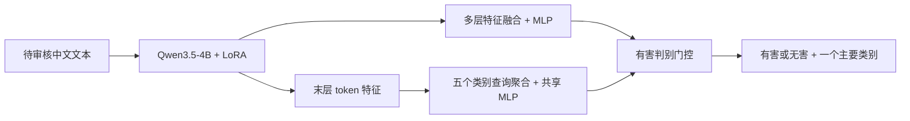

# hanguard

hanguard 是基于 Qwen3.5-4B 的中文输入安全分类器。一次骨干前向计算完成两项判断：**有害／无害**，以及有害文本的**一个主要风险类别**。输入是待审核的原始文本，输出由分类头产生，脚本负责组织展示格式。

当前实现：

- **有害判断**：Qwen3.5-4B + LoRA，融合第 8、16、24、32 层的特征，通过 MLP 输出有害概率。
- **主要类别**：冻结上述骨干和 LoRA，用五个可学习类别查询聚合最后一层的各 token 特征，再由一个共享 MLP 输出五类分数。
- **最终输出**：二分类判为无害时显示“无害｜安全”；判为有害时显示“有害｜得分最高的主要类别”。
- **完整输入**：直接编码正文，不套聊天提示词，不生成答案；当前上限为 4,096 token，超过上限明确报错，不静默截断。



## 快速演示

在项目根目录中使用已验证的本地环境：

```bash
source .venv-hanguard/bin/activate
python demo_infer.py
python infer.py --text '请介绍如何识别网络诈骗，并保护个人信息。'
python infer.py --text '请介绍如何识别网络诈骗，并保护个人信息。' --json
python infer.py --interactive
```

默认读取 `models/hanguard/model.json`。它绑定基座、LoRA、两个分类头、二分类阈值和文件 SHA256；不会退回加载未经训练的基座来冒充 hanguard。演示显示实时模型预测，没有预设答案。

选择 GPU 时可以设置 `CUDA_VISIBLE_DEVICES`，例如：

```bash
CUDA_VISIBLE_DEVICES=6 python demo_infer.py --json
```

批量输入支持 CSV、Parquet、JSON、JSONL；文本字段使用 `prompt`：

```bash
python infer.py --input examples/prompts.jsonl --output outputs/demo_predictions.jsonl --batch-size 8
```

原有电网场景示例保留在 [examples](examples/README.md)，仅作为演示输入，不属于新的训练增强数据。

## HTTP 服务

```bash
python server.py --host 127.0.0.1 --port 8000
```

另一个终端中运行：

```bash
python demo_infer.py --url http://127.0.0.1:8000
curl -s http://127.0.0.1:8000/classify \
  -H 'Content-Type: application/json' \
  -d '{"prompt":"请介绍个人信息保护的基本原则。"}'
```

- `POST /classify`：`{"prompt":"待审核文本"}`。
- `POST /classify/batch`：`{"prompts":["文本一","文本二"]}`。
- `GET /health`：服务存活检查；`GET /ready`：模型就绪检查。

结果包括中文判断、类别 ID／名称、有害概率及五类概率。五类概率表示类别头的分布；是否有害由独立的二分类阈值决定。服务启动后加载一次模型，并串行调度 GPU 推理。

## 当前数据

活动训练目录只保留两份经过审计的数据发布，原始来源保留在 `data/sources/`。

| 数据 | 训练 | 验证 | 测试 | 用途 |
|---|---:|---:|---:|---|
| `data/three_source_translation_repaired/` | 62,155 | 7,753 | 7,778 | 三来源有害／无害判断 |
| `data/hanguard_two_source_primary_20260928/` 全部记录 | 27,618 | 3,451 | 3,452 | 两来源数据与端到端评估 |
| 上述两来源中的有害样本 | 15,578 | 1,875 | 1,828 | 五类主要类别训练与评估 |

三来源为 **WildGuard 中文修复文本、中文整理语料、JailBench**。五分类只使用后两个来源的有害样本，继承原主要类别标签；无害文本不参加五分类损失。两任务目前分阶段训练。

WildGuard 当前范围内的 46,187 条记录经过统一全文重译，保留代码、角色控制串及来源记录；最终主数据为 77,686 条，另有 3,023 条质量疑点／重复冲突记录隔离保存。修复档案和隔离文件仅用于追溯，训练入口只读取三份正式 split 文件。

三集保留既有归属；规范化文本、身份和已知种子组跨集交叉为零。未新增注入增强，来源已有的攻击包装保留。本次修复发布不按旧 370-token 上限删文本；这不代表更早的原始数据整理没有长度筛选。

详见 [数据与来源说明](docs/data.md)、[翻译处理记录](docs/translation_repair.md)、[类别标准核查](docs/primary_category_standard_review.md)。

## 类别含义

| ID | 输出名称 |
|---|---|
| 0 | 安全，仅用于最终无害输出 |
| 1 | 违反社会主义核心价值观的内容 |
| 2 | 歧视性内容 |
| 3 | 商业违法违规 |
| 4 | 侵犯他人合法权益 |
| 5 | 无法满足特定服务类型的安全需求 |

类型头本身预测 1–5 五个类别。类别名参考相关安全标准体系，标签沿用数据来源的既有定义；JailBench 的细分体系与正式国标条目并非逐项相同。一般医疗、法律或金融问题不能仅因领域名称就视为有害。现有标签包含机器标注，本项目没有将其宣称为全量独立人工金标。

## 已完成实验

二分类使用完整三来源测试集 **7,778 条**，E04_s42 在验证集选择的阈值下：准确率 **97.04%**，有害类 F1 **97.16%**。这是一个骨干训练种子的结果。[原始结果](outputs/hanguard_repaired_core_20260928/runs/E04_s42/test_results.json)

五分类使用同一两来源有害测试集 **1,828 条**。下表为三个类型头训练种子的均值 ± 样本标准差，三个头约 70.6 万参数，冻结骨干相同：

| 类型头 | 准确率 | Macro-F1 |
|---|---:|---:|
| 末 token MLP | 79.45% ± 0.81 | 79.02% ± 0.96 |
| 可学习类别查询聚合 | 82.57% ± 2.18 | 81.63% ± 1.95 |
| 类别描述查询聚合 | 81.95% ± 2.37 | 81.02% ± 1.85 |

可学习查询相对 MLP 的准确率平均高 3.12 个百分点，三个种子提升方向一致；类别描述没有稳定的额外收益。默认演示使用可学习查询的 **seed 43**，它在三个候选中的验证交叉熵最低；该单个模型的五分类测试准确率为 **81.02%**，不能将三种子均值当作这个检查点的实测成绩。

完整 [类别实验报告](outputs/hanguard_two_source_primary_20260928/report.md) 与 [结果解读](outputs/hanguard_two_source_primary_20260928/interpretation.md) 保留逐来源、逐类别、逐种子指标。旧测试身份已参与探索，这些结果不是新盲测；当前实验没有独立证明每一种提示注入形式都能被抵御。注意力权重可以用于分析聚合位置，不等同于经验证的因果解释。

## 后续训练与评估

统一入口为 `scripts/hanguard/train.py`，用新的输出目录注册新实验。完整参数、资源与断点规则见 [训练说明](docs/training.md)。先做 CPU 规划检查：

```bash
python scripts/hanguard/train.py binary dry-run --output outputs/binary_next
python scripts/hanguard/train.py category dry-run --output outputs/category_next
```

正式实验：

```bash
python scripts/hanguard/train.py binary run --output outputs/binary_next
python scripts/hanguard/train.py category run --output outputs/category_next
```

类别训练默认使用已完成的 E04_s42 作为冻结父模型。若希望连接新训练的二分类模型，须按训练说明显式指定 `--parent-run`；不要把旧特征缓存复用于不同的骨干或文本。训练入口负责注册数据／代码身份、验证集选点、全部检查点锁定后的测试与报告。执行 `run` 会实际启动训练；本次仓库整理没有重新训练模型。

导出推理文件时，类别种子只按验证交叉熵选取：

```bash
python scripts/hanguard/export_model.py \
  --binary-run outputs/hanguard_repaired_core_20260928/runs/E04_s42 \
  --category-study outputs/hanguard_two_source_primary_20260928 \
  --output models/hanguard_export
python infer.py --model models/hanguard_export/model.json --text '你好'
```

评估当前推理模型：

```bash
python evaluate.py \
  --test data/hanguard_two_source_primary_20260928/test.parquet \
  --output outputs/evaluation/report.json
```

二分类可在完整三来源测试集上评估；五分类正式结论限两来源有害子集。不要将不同测试来源上的分数直接比较为方法增益。

## 环境与模型文件

本机已验证 Python 3.10、PyTorch 2.6.0、Transformers 5.3.0、PEFT 0.18.1、CUDA BF16。运行与训练均使用本地模型文件。新建环境时：

```bash
python3.10 -m venv .venv-hanguard
source .venv-hanguard/bin/activate
python -m pip install --upgrade pip
python -m pip install -r requirements-train.txt
python -m pip install causal-conv1d==1.5.3.post1 --no-build-isolation
```

`causal-conv1d` 为可选 CUDA 加速扩展，需要与 PyTorch、CUDA 工具链匹配；训练速度以实际内核可用情况为准。仅推理可先安装 `requirements.txt`。不要覆盖已有可用环境。

本地保留：`models/Qwen3.5-4B/`、`models/hanguard/`、对照模型 `models/Qwen3Guard-Gen-4B/`。权重、语料和大型输出不进入 Git；新检出代码后需另行放置这些文件，或使用数据与训练文档中的流程生成检查点。

## 仓库结构

```text
hanguard/
├── README.md
├── hanguard_model.py            # 两个分类头共用骨干的运行时
├── infer.py / demo_infer.py     # 命令行推理与实时演示
├── server.py / evaluate.py      # HTTP 服务与评估
├── examples/                   # 通用中文及原有电网演示输入
├── scripts/hanguard/            # 当前训练、导出、数据审计入口
├── tests/                      # 当前运行时、训练与数据约束测试
├── docs/                       # 数据、训练、标准与清理说明
├── data/                       # 原始来源与两份正式数据发布
├── models/                     # 基座、部署分类头与对照模型，本地文件
├── outputs/                    # 当前实验、翻译证据及清理记录
└── archive/                    # 历史代码和必要数据谱系压缩归档
```

旧生成式训练、旧增强数据、过时研究入口及其大型权重／缓存已退出活动目录。保留的部分共用模块沿用历史文件名，例如 `multilabel_heads.py`；当前公开入口训练的是单主类五分类。清理范围严格限定本项目，详见 [清理记录](docs/repository_cleanup.md)。

```bash
CUDA_VISIBLE_DEVICES='' python -m pytest -q tests
```
