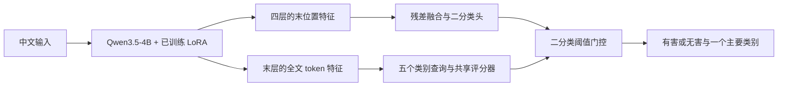

# hanguard 论文写作依据与交接说明

本文面向接手论文写作的 GPT-6 Astra 或研究者，提供项目事实、方法解释、证据边界、实验组织与可核验文献。项目统一称为 **hanguard**。核查日期：2026-09-28；本文件不是论文定稿，也不代表开展了新的实验。

配套的[专利技术说明](patent_writing_guide.md)只提供技术与现有技术对照，最终专利按照用户自有参考格式编写。两个文件共整理 **19 项主要参考文献：16 篇研究论文 R01–R16、3 件公开专利 P01–P03**；专利文件另外列出官方审查规范，作为写作核验依据。

## 接手时先确认这些事实

阅读顺序为 [README](../README.md) → [实验报告](benchmarks.md) → [数据说明](data.md) → [训练指南](training.md)，再按下表定位实现。既有对话只能帮助理解需求，具体实现以代码、冻结协议和结果文件为准。

| 要核实的内容 | 依据 |
|---|---|
| 二分类的层选择、残差融合、分类头 | [repaired_heads.py](../scripts/hanguard/repaired_heads.py) 中 `ExperimentHead`、`TapOnline` |
| LoRA、预热、二分类损失及验证选择 | [repaired_study.py](../scripts/hanguard/repaired_study.py) |
| 类别查询、注意力与共享评分器 | [multilabel_heads.py](../scripts/hanguard/multilabel_heads.py) 中 `MultiLabelHead` |
| 正式五分类损失和评估 | [primary_category_study.py](../scripts/hanguard/primary_category_study.py) |
| 两来源标签范围 | [prepare_two_source_primary.py](../scripts/hanguard/prepare_two_source_primary.py)、[类别标准核查](primary_category_standard_review.md) |
| 两个头怎样共同推理 | [hanguard_model.py](../hanguard_model.py) |
| 验证集选择及推理包导出 | [export_model.py](../scripts/hanguard/export_model.py) |
| 翻译、来源映射、去重隔离 | [翻译处理说明](translation_repair.md)及其链接的构建／审计脚本 |

`multilabel_heads.py` 是共用模块的历史文件名。正式实验是**单主类五分类**，不能据文件名或模块返回的辅助 sigmoid 字段写成多标签学习。正式训练器读取 logits，使用五分类交叉熵；评测及推理使用类别维 softmax。

模型、完整语料和逐样本实验输出不随 Git 分发。若本地没有这些文件，应使用已提交的实验摘要并标明证据范围；不得编造缺失的逐类指标、置信区间、耗时或补实验结果。

## 论文适合讲什么

建议题目：**hanguard：结合多层残差融合与类别查询聚合的中文输入安全分类**。

适合的研究定位是：在中文输入审核中，分别处理“是否有害”和“主要风险类别”，研究安全任务适配后的表征如何被两个轻量模块读取，并以来源适配的监督范围控制类型标签质量。最明确的增益证据来自**类别查询聚合相对参数量接近的末 token MLP**；多层融合可作为系统组成和小幅收益的探索性结果，不能成为“显著提升”的核心宣传。

可以据实组织三个贡献点：

1. 实现一个共用编码器的中文安全分类系统：二分类使用跨层末位置表征，类别分类使用末层全文表征，推理时一次骨干前向产生两个任务的结果。
2. 将类别条件聚合用于适配后的语言模型特征，在相同冻结骨干、相同数据和近似相同类型头参数量下，与末 token MLP 做三种子对照。这里的贡献是任务适配与实证，不是首次提出类别注意力。
3. 给出可追溯的数据处理和评估协议：全文翻译修复、冲突隔离、来源与划分身份保留，以及二分类／类型分类不同的标签使用范围。没有独立数据质量消融时，不把处理流程本身写成已证明的算法增益。

LoRA、softmax 加权、残差连接、类别注意力均有明确先行工作。论文应直接引用 R01–R10、R16；不要为成熟组件换一个新名字后声称原创，也不要声称已经验证两个组件具有协同增益。

## 任务与数据定义

输入为待审核中文文本的 token 序列 $x=(x_1,\ldots,x_T)$。二分类标签 $y\in\{0,1\}$ 表示无害／有害；有害文本的主要类别 $c\in\{1,\ldots,5\}$ 是一个单标签。类别 0 只用于最终无害输出。

五个主类概括如下，细分范围与版本差异以[类别标准核查](primary_category_standard_review.md)为准：

| 类别 ID | 主类概括 |
|---|---|
| 1 | 违反社会主义核心价值观相关内容 |
| 2 | 歧视性内容 |
| 3 | 商业违法违规 |
| 4 | 侵犯他人合法权益 |
| 5 | 特定服务类型的安全需求无法满足 |

| 数据范围 | 训练 | 验证 | 测试 | 使用方式 |
|---|---:|---:|---:|---|
| WildGuard 中文修复、中文整理语料、JailBench | 62,155 | 7,753 | 7,778 | 二分类监督 |
| 中文整理语料与 JailBench 全部记录 | 27,618 | 3,451 | 3,452 | 两来源保存与端到端评估 |
| 上述两来源中的有害样本 | 15,578 | 1,875 | 1,828 | 五类主要类别监督 |

本地 JailBench 记录全部标为有害，两来源中的无害记录均来自中文整理语料。来源与标签分布存在关联，应在来源分层结果和局限中披露，不能假定两来源都有均衡的正负样本。

类型训练的有效范围可表示为：

$$
m_i=\mathbb{1}\{s_i\in\{\text{chinese\_curated},\text{jailbench}\}\land y_i=1\}.
$$

实现通过导出两来源子集、只使用有害样本索引来实现这个约束。没有把 WildGuard 缺乏可靠主类监督的记录当成安全类别，也没有在同一个批次中联合优化两项损失。

数据处理可以写成“来源可追溯的任务适配”，应具体说明：

- 保留文本所属来源、`base_id`、已知 `group_id` 与集合归属。翻译后重新计算正文哈希和 token 数，不能继续将历史身份误当成新正文哈希。
- 对固定范围的 46,187 条 WildGuard 记录统一重译，保留代码和角色控制串，记录原文、旧译文、新译文与修订依据；不根据分类器是否答错选择修复对象。
- 完整档案为 80,709 条；正式三集共 77,686 条，3,023 条质量疑点、重复或冲突记录隔离保存。已知跨集重复按规则隔离，不将测试文本移入训练集。
- 翻译质量筛查与模型输入预算分开。合格正文不静默截断，407 条超过早期 370-token 限制的记录保留，正式数据最长 3,202 token；运行预算为 4,096 token。这不抹去更早数据整理曾存在长度筛选的事实。
- 没有新增注入增强；数据来源已有的攻击包装仍保留。72 条固定抽检由助手双语复核，不是全量人工金标。精确去重与已知组隔离也不等于所有语义近重复都被消除。

R11 可支持控制训练／测试重叠的研究动机；hanguard 没有实现该论文全部子串去重和近重复算法。中文整理语料含自动标注，JailBench 领域标签与正式国标风险条目并非逐项等价。论文采用“两来源既有主要风险类别标签”的任务定义，并引用[标准核查](primary_category_standard_review.md)，不宣称标签已被重新人工统一。

## 方法描述必须对应代码

### 安全任务适配

基座为 Qwen3.5-4B。二分类训练冻结原始预训练参数，通过 LoRA 学习低秩增量，同时训练二分类头：

$$
W'=W+\frac{a}{r}BA.
$$

使用 $r=8$、$a=16$、LoRA dropout 0.05，覆盖配置指定的普通注意力和线性注意力投影。先进行 1 轮分类头预热，再联合更新 LoRA 与头 3 轮；有效 batch 为 128。LoRA 参数会改变骨干产生的中间表征，不能写成“二分类训练始终使用完全固定特征”。LoRA 的方法归属引用 R01。

输入直接编码正文，不套聊天模板、不让模型生成标签文本。模型读取各 block 的隐藏状态，分类头输出分数，程序组织输出格式。

### 二分类：末位置的跨层残差融合

设 $t_*$ 为最后一个有效 token，$\mathcal L=\{8,16,24,32\}$，层编号从 1 开始，$h_{t_*}^{(\ell)}$ 为对应 block 输出。它们不是词表 logits，末层状态也位于骨干最终归一化之前。输入 LayerNorm 记作 $N_0$，投影宽度 $d=128$：

$$
u_\ell=N_\ell\!\left(\mathrm{GELU}(W_\ell N_0(h_{t_*}^{(\ell)})+b_\ell)\right),\qquad
\alpha_\ell=\frac{\exp(a_\ell)}{\sum_{j\in\mathcal L}\exp(a_j)}.
$$

$$
z=\mathrm{GELU}(W_0N_0(h_{t_*}^{(32)})+b_0)
  +W_f\sum_{\ell\in\mathcal L}\alpha_\ell u_\ell+b_f,
\qquad p_h=\sigma(w^\top\mathrm{Dropout}(z)+b).
$$

$W_f,b_f$ 零初始化，使初始化时输出保留末层直接路径。层权重 $\alpha_\ell$ 是全局可学习参数，不随输入改变；各层先形成特征，再共同进入一个二分类器。代码没有逐层独立投票、动态路由或默认全文池化。零初始化的作用可以从计算图解释，但“消除梯度冲突”“保证优化稳定”需要额外实验。

损失为句级二元交叉熵。检查点按验证集 BCE 选择，阈值按验证集准确率选择。R02 是跨层标量混合的参考，R04 是残差学习背景；R03、R16 是跨层表征利用的相关工作。hanguard 不等同于这些论文的完整方法。

### 五分类：类别查询聚合与共享评分

该阶段冻结已适配的骨干、LoRA 和二分类头，仅训练类型头。每个类别有固定高斯随机种子 $s_c$，以及可训练的类别残差 $e_c$。种子注册为 buffer，不接受梯度；经过可训练投影和归一化后得到查询：

$$
q_c=N_q(W_qN_0(s_c)+b_q+e_c),\quad
k_t=N_q(W_qN_0(h_t^{(32)})+b_q),\quad
v_t=N_v(\mathrm{GELU}(W_vN_0(h_t^{(32)})+b_v)).
$$

$$
\beta_{c,t}=\mathrm{softmax}_{t\in\mathrm{valid}}
  \left(q_c^\top k_t/\sqrt d\right),\qquad
r_c=\sum_{t\in\mathrm{valid}}\beta_{c,t}v_t.
$$

$$
g_c=\mathrm{MLP}_{shared}([r_c;q_c;r_c\odot q_c]),\qquad
p_c=\mathrm{softmax}_c(g),\qquad \hat c=\arg\max_c p_c.
$$

共享评分器为 `Linear(3d,d) → GELU → Dropout → Linear(d,1)`。注意力的 softmax 在文本位置维归一化，五分类输出的 softmax 在类别维归一化，两者不能混淆。最终类别不是“哪个类向量与整句余弦相似度最高”，也不是人工预设关键词匹配。

默认 `learned_queries` 使用随机种子和可训练变换；`description_queries` 把种子替换为编码后的类别描述，是单独的对照。不能将默认模型写成“由国标定义向量引导”，更不能说已证明描述初始化更优。R05、R07、R08 与类别条件聚合最相关，R06 可用于讨论描述语义对照。

### 两分支的关系与推理决策

这不是“先做多层融合，再把融合后的向量传给类别查询”。两个头读取同一骨干的不同特征。训练是分阶段的，推理共享一次骨干前向。类型训练不会反向改变二分类预测。

当 $p_h<\tau$ 时输出无害、类别 0；否则输出有害及 $\hat c$。参考检查点阈值为 $\tau=0.5133533670253186$，来自验证集并在测试时冻结。无害输入仍可计算出类型头的五类分数，但不将其作为最终风险类别。

## 已有实验证据及可写结论

这些测试记录的既有划分身份已多轮用于方法探索，翻译修复后沿用原身份；以下结果不是新建立的独立盲测。新增外部或未使用留出集的验证仍待完成。

### 二分类融合的证据强度

同一修复后三来源测试集，共 7,778 条，训练种子为 42：

| 方法 | 准确率 | 有害 F1 | AUROC |
|---|---:|---:|---:|
| LoRA + 末层 MLP（E03） | 96.8244% | 96.9502% | 99.5624% |
| LoRA + 残差多层融合（E04） | 97.0429% | 97.1640% | 99.5578% |

融合方法净多判对 17 条，准确率增加 **0.2186 个百分点**；E04 独对 72 条、E03 独对 55 条，探索性 McNemar exact $p=0.1554$，未做多重比较校正。固定 0.5 阈值时，准确率分别为 96.8887% 与 97.0558%，差 0.1671 个百分点。

可写“单种子实验中准确率和 F1 小幅改善”。不可写“显著提升”“多种子稳定提升”或“各指标全面更优”。两个二分类头也没有做参数量匹配，额外投影容量是潜在混杂因素。E03 验证准确率 97.4333% 高于 E04 的 97.2785%；E04 的每个检查点经过验证选择，不等于融合架构通过验证集成为所有方法中的最优选择。

### 类型头是更适合展开的实证重点

以下三个类型头共用冻结 E04 骨干，使用同一两来源有害测试集 1,828 条，类型头种子为 42、43、44。数值为均值 ± 样本标准差：

| 类型头 | 参数量 | 五分类准确率 | 五分类 Macro-F1 | 两来源门控六分类准确率 |
|---|---:|---:|---:|---:|
| 末 token MLP | 705,655 | 79.45 ± 0.81% | 79.02 ± 0.96% | 88.79 ± 0.43% |
| 可学习类别查询 | 706,177 | **82.57 ± 2.18%** | **81.63 ± 1.95%** | **90.45 ± 1.10%** |
| 类别描述查询 | 706,177 | 81.95 ± 2.37% | 81.02 ± 1.85% | 90.12 ± 1.23% |

可学习查询相对 MLP 的准确率平均增加 **3.12 个百分点**，三个种子方向一致。标准差是种子间波动，不是置信区间；这里没有覆盖骨干训练的随机性。两来源门控六分类使用全部 3,452 条测试记录，不能与三来源二分类准确率直接相减。

参考导出模型在可学习查询的三个种子中按最低验证 CE 选择 seed 43；该模型五分类准确率 **81.02%**、Macro-F1 **80.50%**，门控六分类准确率 **89.72%**。不要将 82.57% 写成部署检查点成绩，也不要按测试最高的 seed 44 选模型。

### 与 Qwen3Guard 的比较怎样使用

本地保留了 Qwen3Guard-Gen-4B 在同一 7,778 条文本上的系统参考结果：

| 三值输出映射 | 二分类准确率 | 有害 F1 |
|---|---:|---:|
| 仅 Unsafe 视为有害 | 90.13% | 89.67% |
| Unsafe 或 Controversial 视为有害 | 94.74% | 94.91% |

两种映射都应披露，不能只选择更差的口径放大优势。其基座、训练数据、任务定义和本地适配程度与 hanguard 不同，且可能存在无法排除的预训练数据重叠。它是外部系统对比，不是归因于某个模块的严格消融。类型标签体系不同，不能直接拿其类别名称计算本项目五分类准确率；未提供连续分数时也不要编造 AUROC。

数值追溯路径为本地 `outputs/hanguard_repaired_core_20260928/summary.json`、各 run 的 `test_results.json`，以及 `outputs/hanguard_two_source_primary_20260928/report.json`。公开摘要见[实验报告](benchmarks.md)。

## 还缺哪些能支撑论文的实验

以下都是**待做事项**，不是已完成结果；本文件不授权自动启动训练。

若论文要主张“融合 A 与查询 B 组合最好”，应采用同一评价范围做完整交叉对照：

| 二分类骨干 | 类型头 | 两来源端到端实验状态 |
|---|---|---|
| LoRA + 末层 MLP（E03） | 末 token MLP | 需要在 E03 特征上训练类型头 |
| LoRA + 多层融合（E04） | 末 token MLP | 已有类型头实验 |
| LoRA + 末层 MLP（E03） | 类别查询 | 需要在 E03 特征上训练类型头 |
| LoRA + 多层融合（E04） | 类别查询 | 已有类型头实验 |

四组共同报告两来源六分类、类型 Macro-F1，以及各自完整三来源二分类指标。骨干种子、类别头种子、数据、预算、参数量和验证选择应尽可能匹配。不能把“E04 对 E03 的二分类提升”与“查询对 MLP 的五分类提升”拼成同一个 A/B/AB 结论；四组结果也不应被预设成某种排序。

优先补充：

1. **跨骨干种子与容量对照**：二分类至少扩展多个种子，加入参数量匹配的末层头、等权融合、去残差和不同选层对照。逐一改变因素，不用更多参数的结果单独证明层信息互补。
2. **类型查询机制拆分**：随机／描述初始化、共享／类别独立评分器、去掉查询身份或乘积交互、全局池化等。已经做过的描述对照不能写成尚未尝试，也不能隐藏其未进一步提高均值的结果。
3. **可解释性验证**：展示类别注意力位置与错误样例；再做删除高权重片段、随机等长度片段、保留片段等对照，报告分数变化及人工合理性复核。文本扰动可能改变分布，结果仍需谨慎解释。仅热力图不能支持“因果解释”，参考 R10。
4. **泛化与统计**：在未反复用于调参的外部或新留出数据上确认；对已知种子组做组级重采样，报告跨种子差值、区间和来源分层。不要把样本级 bootstrap 当作已经处理组内相关性。
5. **工程开销**：在同一 GPU、精度、batch、token 长度和预热规则下测吞吐、延迟与显存，区分骨干耗时和分类头耗时。一次前向是架构事实，不等于已经测得某个百分比的加速。

## 论文组织建议

此处只建议论文的组织，专利不沿用这份结构。

| 部分 | 建议回答的问题 | 应放的证据 |
|---|---|---|
| 引言 | 为什么中文输入审核需要同时输出是否有害与主要类别？为什么末位置分类器可能遗漏类别相关信息？ | 任务需求与已有工作，不预先宣称各层固定对应某种安全语义 |
| 相关工作 | 安全分类、内部表征、类别条件聚合分别有哪些先例？ | R01–R16，明确本项目借鉴和未实现部分 |
| 方法 | 两个头分别读取什么？如何训练？最终如何门控？ | 上述公式、共享骨干图、两阶段参数冻结表 |
| 数据与设置 | 来源、标签范围、翻译修复、三集身份和模型选择怎样控制？ | 样本量、来源说明、协议、标签局限 |
| 结果与消融 | 哪个模块确有提升？哪个结论只有探索性支持？ | 单种子二分类、三种子类型头、外部系统参考，统计口径分开 |
| 分析与局限 | 聚合关注什么？哪些错误仍存在？对新数据有何证据？ | 解释性、错误分析、未完成实验及数据偏差 |

可准备四种图表：共享骨干两分支示意图、来源与监督范围表、同骨干类型头对照图、带随机对照的类别关注位置示例。涉及尚未开展的分析时先留下“待实验”标记，不自动生成看似真实的曲线或误差条。

适合摘要的措辞是：“在同一冻结安全适配骨干上，类别查询聚合相较参数量接近的末位置 MLP，在三个类型头训练种子上的主要类别准确率平均增加 3.12 个百分点。”后接数据与骨干范围。不要扩大成“大幅提升所有有害识别指标”“全面超过通用安全模型”或“实现多标签理解”。

## 参考文献与方法归属（R01–R16）

条目均核对论文原文、作者原稿或出版机构页面。文献中的方法和 hanguard 的实现关系分开表述；编号供两个交接文件交叉引用，并非要求论文必须全部引用。这里的 R 编号是书目编号，与本地训练协议中的实验编号分开使用。

### R01 · LoRA：直接使用的训练组件

Edward J. Hu et al. **LoRA: Low-Rank Adaptation of Large Language Models**. ICLR, 2022（arXiv 初稿 2021）。[论文](https://arxiv.org/abs/2106.09685) · [PDF](https://arxiv.org/pdf/2106.09685) · [作者机构出版记录](https://www.microsoft.com/en-us/research/publication/lora-low-rank-adaptation-of-large-language-models/)。

用低秩增量适配冻结预训练权重。用于解释第一阶段如何更新安全特征；不能把该适配机制本身作为 hanguard 的原创贡献。

### R02 · ELMo：多层标量混合

Matthew E. Peters et al. **Deep Contextualized Word Representations**. NAACL-HLT, 2018, 2227–2237. DOI: `10.18653/v1/N18-1202`。[论文](https://aclanthology.org/N18-1202/) · [PDF](https://aclanthology.org/N18-1202.pdf)。

任务相关的 softmax 标量权重混合多层语言表征，可对应跨层融合的动机。hanguard 使用选定 block、独立投影和残差路径，没有采用其双向 LSTM 架构；不能照搬其层级语义解释。

### R03 · Deep Layer Aggregation：跨层聚合背景

Fisher Yu, Dequan Wang, Evan Shelhamer, Trevor Darrell. **Deep Layer Aggregation**. CVPR, 2018, 2403–2412。[论文](https://openaccess.thecvf.com/content_cvpr_2018/html/Yu_Deep_Layer_Aggregation_CVPR_2018_paper.html) · [PDF](https://openaccess.thecvf.com/content_cvpr_2018/papers/Yu_Deep_Layer_Aggregation_CVPR_2018_paper.pdf)。

通过迭代和层次聚合整合视觉网络特征。可用于相关工作中的跨层融合脉络；hanguard 没有复现其聚合节点或完整网络。

### R04 · ResNet：残差学习基础

Kaiming He, Xiangyu Zhang, Shaoqing Ren, Jian Sun. **Deep Residual Learning for Image Recognition**. CVPR, 2016, 770–778. DOI: `10.1109/CVPR.2016.90`。[出版记录](https://www.microsoft.com/en-us/research/publication/deep-residual-learning-for-image-recognition/) · [PDF](https://arxiv.org/pdf/1512.03385)。

保留直接路径、学习残差修正是成熟思想。可解释 hanguard 的末层直接分支与融合残差，不能据此证明本项目零初始化分支必然改善优化，也不能将其称为新残差算法。

### R05 · CAML：逐类文本证据聚合

James Mullenbach et al. **Explainable Prediction of Medical Codes from Clinical Text**. NAACL-HLT, 2018, 1101–1111. DOI: `10.18653/v1/N18-1100`。[论文](https://aclanthology.org/N18-1100/) · [PDF](https://aclanthology.org/N18-1100.pdf)。

为每个医疗编码学习注意力并聚合文档内容，是类别条件聚合的重要先例。hanguard 使用语言模型 token 特征、查询交互和共享评分器，输出单主类 softmax；没有复现其 CNN 与多标签 BCE。

### R06 · LSAN：标签语义与内容表示

Lin Xiao, Xin Huang, Boli Chen, Liping Jing. **Label-Specific Document Representation for Multi-Label Text Classification**. EMNLP-IJCNLP, 2019, 466–475. DOI: `10.18653/v1/D19-1044`。[论文](https://aclanthology.org/D19-1044/) · [PDF](https://aclanthology.org/D19-1044.pdf)。

结合标签语义与文档内容形成标签专属表示。适合讨论描述查询对照；hanguard 默认随机可学习查询，没有实现该文的双路自适应融合，也不能套用其多标签结果定义。

### R07 · LEAM：词和标签的关联建模

Guoyin Wang et al. **Joint Embedding of Words and Labels for Text Classification**. ACL, 2018, 2321–2331. DOI: `10.18653/v1/P18-1216`。[论文](https://aclanthology.org/P18-1216/) · [PDF](https://aclanthology.org/P18-1216.pdf)。

在共同空间中建模词与标签的相容性，再形成文本表示。为查询与 token 的关联提供相关背景；项目没有复现其短语相容性算子或联合词向量训练。

### R08 · Query2Label：类别作为查询

Shilong Liu, Lei Zhang, Xiao Yang, Hang Su, Jun Zhu. **Query2Label: A Simple Transformer Way to Multi-Label Classification**. arXiv:2107.10834, 2021。[论文](https://arxiv.org/abs/2107.10834) · [PDF](https://arxiv.org/pdf/2107.10834)。

通过类别查询从视觉特征中提取类别相关信息。hanguard 采用轻量点积聚合和共享 MLP，没有完整 Transformer decoder，且任务为中文单主类分类。本次仅核实预印本，不填写未经核实的会议。

### R09 · ABMIL：注意力池化对照

Maximilian Ilse, Jakub Tomczak, Max Welling. **Attention-based Deep Multiple Instance Learning**. ICML, 2018, PMLR 80:2127–2136。[论文](https://proceedings.mlr.press/v80/ilse18a.html) · [PDF](https://proceedings.mlr.press/v80/ilse18a/ilse18a.pdf)。

通过可学习注意力或门控注意力聚合实例。项目 `attention`／`fusion_attention` 对照使用相近门控池化，默认 `fusion` 不含该池化。上下文 token 也不应直接当作独立实例或人工标注的有害位置。

### R10 · 注意力与解释性的界限

Sarthak Jain, Byron C. Wallace. **Attention is not Explanation**. NAACL-HLT, 2019, 3543–3556. DOI: `10.18653/v1/N19-1357`。[论文](https://aclanthology.org/N19-1357/) · [PDF](https://aclanthology.org/N19-1357.pdf)。

提醒研究者区分注意力分配与忠实的决策解释。用于约束本项目解释性措辞，提出扰动、保留证据及随机对照，而不是用热力图直接宣称模型找到了真实因果依据。

### R11 · 去重与评估可信度

Katherine Lee et al. **Deduplicating Training Data Makes Language Models Better**. ACL, 2022, 8424–8445. DOI: `10.18653/v1/2022.acl-long.577`。[论文](https://aclanthology.org/2022.acl-long.577/) · [PDF](https://aclanthology.org/2022.acl-long.577.pdf)。

研究重复文本和训练／测试重叠对语言模型的影响，并提出去重方法。用于论证来源、重复和划分检查的必要性；本项目没有复现该文全部近重复流程，其语言建模收益也不能直接当作本项目分类收益。

### R12 · WildGuard：安全任务与数据来源

Seungju Han et al. **WildGuard: Open One-stop Moderation Tools for Safety Risks, Jailbreaks, and Refusals of LLMs**. NeurIPS, 2024, Datasets and Benchmarks Track。[论文](https://papers.nips.cc/paper_files/paper/2024/hash/0f69b4b96a46f284b726fbd70f74fb3b-Abstract-Datasets_and_Benchmarks_Track.html) · [PDF](https://papers.nips.cc/paper/2024/file/0f69b4b96a46f284b726fbd70f74fb3b-Paper-Datasets_and_Benchmarks_Track.pdf)。

提供提示有害性、回复有害性及拒答识别任务。hanguard 只使用相关中文化文本开展输入分类；不覆盖其全部任务，翻译质量也属于本项目处理责任。

### R13 · Qwen3Guard：外部安全分类系统

Haiquan Zhao et al. **Qwen3Guard Technical Report**. arXiv:2510.14276, 2025。[论文](https://arxiv.org/abs/2510.14276) · [PDF](https://arxiv.org/pdf/2510.14276) · [作者仓库](https://github.com/QwenLM/Qwen3Guard)。

包含生成式与流式安全检测方案。hanguard 比较对象为 Gen-4B，应明确三值安全标签映射和本地适配差异；不能将外部系统差值解释为内部融合模块的因果收益。

### R14 · JailBench：中文风险类别与数据来源

Shuyi Liu, Simiao Cui, Haoran Bu, Yuming Shang, Xi Zhang. **JailBench: A Comprehensive Chinese Security Assessment Benchmark for Large Language Models**. PAKDD, 2025；arXiv:2502.18935。[论文](https://arxiv.org/abs/2502.18935) · [PDF](https://arxiv.org/pdf/2502.18935) · [作者仓库](https://github.com/STAIR-BUPT/JailBench)。

提供中文安全分类体系与越狱提示构造。项目沿用其来源标签和已知种子关系，但内部划分不是原论文官方评测协议；作者采用的标准版本及类别细化也需按来源如实交代。

### R15 · ShieldHead：安全分类头与位置监督的相关工作

Zitao Xuan et al. **ShieldHead: Decoding-time Safeguard for Large Language Models**. Findings of ACL, 2025, 18129–18143. DOI: `10.18653/v1/2025.findings-acl.932`。[论文](https://aclanthology.org/2025.findings-acl.932/) · [PDF](https://aclanthology.org/2025.findings-acl.932.pdf)。

在隐藏状态上附加安全头，结合句级监督和位置标签消歧开展解码时检测。项目曾探索其 prompt-only 适配，默认部署方案没有使用伪标签，也不具备该论文意义上的流式解码防护。引用位置为相关工作或负结果讨论。

### R16 · SIREN：内部多层表征安全检测

Difan Jiao et al. **LLM Safety From Within: Detecting Harmful Content with Internal Representations**. ACL, 2026, 39711–39727. DOI: `10.18653/v1/2026.acl-long.1844`。[正式论文](https://aclanthology.org/2026.acl-long.1844/) · [PDF](https://aclanthology.org/2026.acl-long.1844.pdf) · [作者代码](https://github.com/CSSLab/SIREN)。

冻结基座，通过逐层稀疏探针筛选安全相关神经元并进行性能加权聚合。与项目共享利用内部安全表征的动机；hanguard 没有稀疏神经元筛选，使用的是 LoRA 适配及稠密残差融合，不能称为 SIREN 复现。此处指检测论文，不是同名或近名攻击工作。

## 给后续写作者的最后约束

正式写作前先列出“已实现、已测得、待验证”三种事实，逐句检查贡献和摘要是否有证据支持。引用上述文献表达继承关系，不复述为项目原创；新增技术设想必须标为拟议，不得补造训练日志、显著性、专家标注、论文接收记录或专利授权结论。若用户提供目标期刊或论文模板，再调整格式，不改变这些事实边界。
